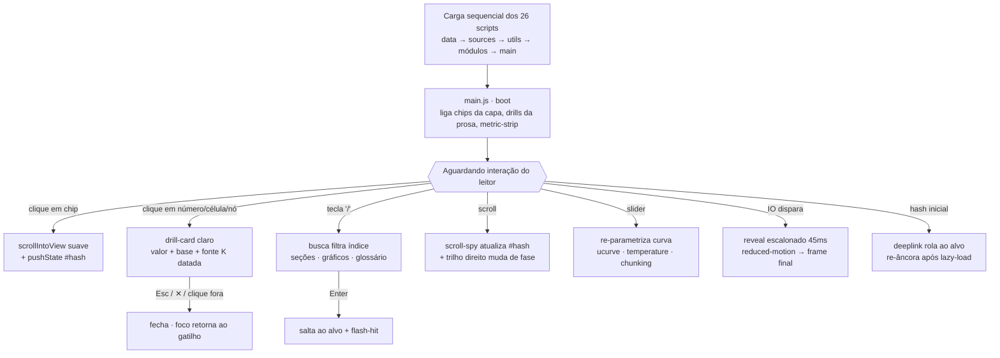

<div align="center">

# 🌐 PÁGINA INTERATIVA PÚBLICA

## 👉 **[https://llms-interativo.b0-y-z4kr14.workers.dev/](https://llms-interativo.b0-y-z4kr14.workers.dev/)** 👈

*Edição interativa completa — capa animada de 4 estados, 13+ gráficos drillable, comparador, busca e glossário*

# 📰 REVISTA · EDIÇÃO ESPECIAL PDF

## 👉 **[revista/README.md](revista/README.md)** 👈

*25 páginas premium landscape — narrativa, fotografia editorial e os seis números da obra*

</div>

---

<div align="center">

# 📐 A Matemática Inevitável dos LLMs
### Da Estocasticidade Lexical à Orquestração Multi-Agente

**Obra consolidada + Edição Interativa de Pesquisa** — 14 capítulos, 4 partes, 21.305 palavras de prosa acadêmica, transformados num site editorial de grau McKinsey/GS: capa animada de 4 estados, 13+ gráficos assinatura drillable, comparador de benchmarks, busca, glossário e tema escuro fosco.


</div>

---

## 📖 Sobre o Projeto

Este repositório contém artefatos gêmeos:

1. **📕 A Obra** (`manuscrito/`) — consolidação de 9 manuscritos autorais (+2 figuras) sobre arquitetura de LLMs, o fenômeno *Lost in the Middle*, a praxeologia do chunking, a formalização em grafos de um orquestrador multi-agente e o estudo de caso Kimi K2.5. Três duplicatas exatas foram eliminadas; o português foi unificado para pt-BR; as ~47 fórmulas do manuscrito do orquestrador (perdidas como imagens no original) foram reconstruídas por inferência contextual duplamente auditada e assinaladas com as notas `rec1–rec10`.

2. **🌐 A Edição Interativa** (`site/`) — o site que dá forma visual à obra: cada número é drillable (valor + base + fonte datada), cada gráfico codifica a estrutura real do fenômeno, e o átomo temático — *a janela de contexto como fita de células de token* — recorre da capa ao painel lateral.

3. **📰 A Revista** (`revista/`) — a edição especial em PDF: 25 páginas de magazine premium com fotografia editorial, big-numbers e a prova em quatro movimentos.

---

## ✨ Destaques

| Módulo | O que faz |
|--------|-----------|
| 🎬 **Capa de 4 estados** | A · fita recursiva (zoom-out infinito) · B · fita explodida (tokens→embeddings→QKᵀ→softmax) · C · planta-baixa wireframe · D · unboxing — persistência em `localStorage` |
| 📉 **Curva em U interativa** | Sliders α/β/N deformam a diluição atencional; pontos de Liu et al. (2023) e linha closed-book 56,1%; nota de honestidade paramétrica |
| 📏 **Dumbbell W_nom × W_eff** | 5 pares nominal→efetiva em eixo log; gap vermelho = janela perdida |
| 🧮 **Fronteira do chunking** | Q(k) com restrição k·s ≤ W; slider W desloca a fronteira; ótimo econômico k ≈ 5 |
| 🏛️ **Topologia AAT/AVC** | Grafo dirigido com anéis de *entropy budget*, arestas ponderadas e laço de refutação F(h)=1 |
| 📊 **Matriz de 45 benchmarks × 6 modelos** | Melhor-da-linha em azul, drill por célula com fonte K1–K30 |
| ⚖️ **Comparador de modelos** | 2 selects → barras pareadas por categoria + Δ numérico |
| 🔎 **Busca + deep-links + glossário** | Atalho `/`, scroll-spy com hash, 18 termos deep-linkáveis |
| ♿ **Acessibilidade** | Teclado completo (Esc fecha drill e devolve foco), ARIA/landmarks, skip-link, reduced-motion integral, contraste medido 13,6:1 |
| 📱 **Responsivo** | 0 overflow horizontal de 390px a 1680px; véus de affordance em containers roláveis |

---

## 📚 A Obra em Números

| Métrica | Valor |
|---------|-------|
| Partes / Capítulos | 4 / 14 |
| Palavras de prosa | 21.305 |
| Referências bibliográficas | 65 (34 com URL) |
| Tabelas preservadas | 11 (incl. 45 benchmarks íntegros) |
| Fórmulas LaTeX | 48 blocos + dezenas inline |
| Notas de rodapé | 7 metodológicas + 10 de reconstrução (rec1–rec10) |
| Figuras originais | fig2 (modelo formal) · fig4 (evolução das janelas) |

**Estrutura:** I · Fundamentos (a inevitabilidade matemática) → II · A Janela de Contexto e o *Lost in the Middle* → III · Orquestração Multi-Agente (formalização em grafos) → IV · Estudo de Caso Kimi K2.5.

---

## 🗂️ Estrutura do Repositório

```
├── README.md                     ← este arquivo
├── revista/
│   └── README.md                 ← 📰 página da revista (PDF via CDN própria)
├── manuscrito/                   ← 📕 a obra consolidada em 6 partes + MANIFEST
├── docs/
│   ├── plan.md                   ← plano de execução do pipeline
│   └── data_audit/               ← relatório + 11 JSONs da auditoria de dados
└── site/                         ← 🌐 EDIÇÃO INTERATIVA
    └── css/                      ← style.css · site.css (tema escuro fosco)
```

> **Mídia e binários** (PDF da revista, avatar, bandeira de Gadsden, capa) são servidos via CDN própria — Cloudflare Workers + KV na conta do autor, cache permanente: `llms-interativo.b0-y-z4kr14.workers.dev`.

---

## 🧭 Arquitetura do App

> Gerado com o skill `code-to-diagram`. O app é **zero-build vanilla JS**: os 26 módulos são IIFEs carregados por `<script>` em ordem — sem imports ES — e comunicam-se por **globais compartilhadas** (`window.RPT`, `window.U`, `window.SOURCES`, `window.FOOTNOTES`).

### Arquitetura de módulos

```mermaid
graph TD
  HTML["index.html<br/>26 módulos em ordem de carga"]

  subgraph FND["Fundação — globais compartilhadas"]
    DATA["data.js<br/>window.RPT · 15 datasets"]
    SRC["sources.js<br/>window.SOURCES · âncoras K1–K30"]
    UTL["utils.js<br/>window.U · canvas · drill · tooltip · thickText"]
    FNT["footnotes.js<br/>window.FOOTNOTES · fn1–7 · rec1–10"]
  end

  subgraph COVER["Capa — máquina de 4 estados"]
    COVA["cover.js<br/>A · fita recursiva"]
    COVB["cover-exploded.js<br/>B · explodida / D · unboxing"]
    COVC["cover-wire.js<br/>C · planta-baixa"]
  end

  subgraph CHARTS["Gráficos assinatura — IIFEs independentes"]
    EVI["chart-evidence · fita §0"]
    TMP["chart-temperature · laboratório softmax"]
    WIN["chart-windows · rampa log"]
    WEF["chart-weff · dumbbell nominal×efetiva"]
    UCV["chart-ucurve · curva em U"]
    PK["chart-pk · P = 1−2/k"]
    CHK["chart-chunking · fronteira k·s ≤ W"]
    MDL["chart-models · 7 modelos"]
    TOP["chart-topology · grafo AAT/AVC"]
    BEN["chart-benchmarks · matriz 45×6"]
    CMP["chart-compare · comparador"]
    BRC["chart-browsecomp · progressão"]
    VRD["chart-verdict · balança"]
  end

  subgraph UX["UX transversal"]
    DSH["dashboard.js · trilho direito P14"]
    SRR["sources-render.js · tabela de fontes"]
    SCH["search.js · busca '/'"]
    DLK["deeplink.js · hash + scroll-spy + skip-link"]
    POL["polish.js · reveals IO · véus · keyable"]
  end

  BOOT["main.js · boot<br/>chips hash · drills da prosa · metric-strip"]

  HTML --> FND
  HTML --> COVER
  HTML --> CHARTS
  HTML --> UX
  HTML --> BOOT

  DATA -->|RPT| WIN & WEF & MDL & TOP & BEN & CMP & BRC & VRD
  SRC -->|K-âncoras| SRR
  UTL -.->|helpers| COVER
  UTL -.->|helpers| CHARTS
  UTL -.->|drill-card| BOOT
  FNT -->|notas inline| POL
```



### Fluxo de runtime



---

## 🚀 Como Visualizar

- **Site (público):** https://llms-interativo.b0-y-z4kr14.workers.dev/
- **Revista (PDF público):** https://llms-interativo.b0-y-z4kr14.workers.dev/revista.pdf
- **Local:** `open site/index.html` ou a versão autocontida `site/single.html` (via file://)

**Snapshots de versão** (rollback sob demanda): `5eb2445` original · `de6f742` marfim fosco · `a84307d` aprimoramento total · `fa55f88` tema escuro fosco · `7ec792c` avatar + créditos do autor.

---

## 🎨 Design System

| Token | Valor | Uso |
|-------|-------|-----|
| `--paper` | `#201d19` | fundo carvão quente fosco |
| `--paper-hi` | `#2b2823` | superfícies tom-sobre-tom |
| tinta | `#ece7db` / `#b7ae9e` / `#9a9384` | texto principal / secundário / hints |
| acento | `#7d9bff` | azul elétrico claro (links, séries, foco) |
| semântico | `#d4607a` | quedas, zona morta, lacunas |
| tipografia | **ET Book** (400/700) + **Menlo** mono | micro-espessura via `text-shadow 0 0 .3px` — sem negrito artificial |

---

## 🧪 Qualidade Verificada

- ✅ 0 pageerrors / 0 console errors em 1680 · 1280 · 768 · 390 px (index **e** single)
- ✅ `node --check` em 26/26 módulos JS · `document.fonts.check('16px et-book') === true`
- ✅ Contraste WCAG medido par a par (13,6:1 principal · 6,4:1 azul · 4,6:1 vermelho)
- ✅ QA adversarial independente com falsificação (pixel-diff, teclado sintético, reduced-motion emulado)
- ✅ **Auditoria de dados** (skill `dataset-quality-audit`): 11 datasets auditados — **média 97,2/100 (A+)**; os 2 graus B são padrões deliberados de fidelidade às fontes (nulos = "não avaliado"; `*` = marca do fabricante), não defeitos → [relatório completo](docs/data_audit/RELATORIO_AUDITORIA_DADOS.md)

---
---

## 📜 Licença e Filosofia

<div align="center">

### ⚔️ DECLARAÇÃO DE SOBERANIA INTELECTUAL


</div>

---

### 🏴 "Propriedade Intelectual Não Existe"

> *"Ideias são superabundantes e não-rivais. A mimese jamais configurará expropriação."*
>
> — **Stephan Kinsella**, Contra a Propriedade Intelectual

---

### 🔥 A Falácia da Propriedade Intelectual

Na perspectiva TecnoLibertária, a **propriedade intelectual** constitui uma **aberração conceitual** — uma falácia lógica incapaz de sustentar-se ante a natureza **superabundante** e **não-rival** das ideias.

Diferente de bens tangíveis, **copiar software não priva o autor original** do uso de seu código. Portanto, inexiste "roubo" no compartilhamento de conhecimento — apenas **multiplicação de valor sem custo marginal**.

| 📜 Conceito | 🏛️ Visão Estatal | ⚔️ Visão Libertária |
|------------|-----------------|-------------------|
| **Software** | "Obra literária" protegida pela Lei 9.609/98 | Informação livre, não-escassa |
| **Cópia** | "Pirataria" criminosa | Aprendizado legítimo, replicação ética |
| **Garantia** | Registro no INPI (órgão estatal) | Reputação do autor + contratos privados |

---

### 💀 LICENCIAMENTO: DOMÍNIO PÚBLICO ABSOLUTO

<div align="center">


**🐍 DON'T TREAD ON ME 🐍**

</div>

Este software é liberado ao **DOMÍNIO PÚBLICO** sem quaisquer restrições:

| 🗡️ USE | 🛡️ MODIFIQUE | ⚔️ VENDA | 🔓 DISTRIBUA |
|--------|-------------|---------|-------------|
| Para qualquer finalidade | Sem pedir permissão | Lucre como quiser | Sem restrições |

---

## 👨‍💻 Créditos

<div align="center">


### **B0.y_Z4kr14**

⚔️ Desenvolvedor Libertário · 🏴 TecnoLibertária · 🐍 Don't Tread On Me

[](https://github.com/B0yZ4kr14)
[](docs/DONATIONS.md)
[](docs/DONATIONS.md)

</div>

---

## 🌟 Agradecimentos
🐍 **TSi Telecom**

🐍 **Ludwig von Mises**

🐍 **Murray Rothbard**

🐍 **Immanuel Kant**

🐍 **Ayn Rand**

🐍 **rothbardbrasil.com**

🌿 **AbilideBoB**

🐍 **Yeshua**

🐍 **YHWH**

---

<div align="center">

### 🏴 Desenvolvido com  🔥🔥  e Liberdade

**A Matemática Inevitável dos LLMs** © 2026 B0.y_Z4kr14 · Domínio Público Absoluto

🐍 **Don't Tread On Me** 🐍
</div>
